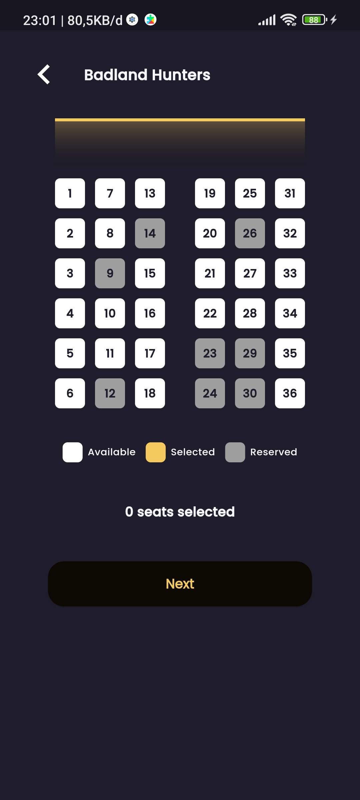

# Flix Ids - Movie Ticket Booking App

### 🚧🚧 Still under development 🚧🚧

Flutter project from Udemy
course [Full Stack Flutter FlixID: Simulasi Pemesanan Tiket Bioskop](https://www.udemy.com/course/flutter-flixid/).
With teacher [Erico Darmawan Handoyo](https://www.udemy.com/user/erico-darmawan-handoyo/).

## Getting Started

This project is a starting point for Flutter application, where user can see the list of movies.
User can also see the details of the movie by clicking on the list item. And then user can
booking the movie by clicking on the book button, and user can choose the date and time for seat
of the movie.

## Tech Stack

- Flutter
- Clean Architecture
- Riverpod
- Firebase for authentication and storage
- TMDB API for movie data

## Features

- User register, login, update, logout
- User can see the list of movies
- User can see the details of the movie
- User can book the movie
- User can choose the date and time for seat of the movie
- User can see the list of booked movies in history transaction
- Update the user profile with profile picture and name

## Screenshots

|                          Login Page                          |                      Register Page                      |
|:------------------------------------------------------------:|:-------------------------------------------------------:|
|                 |         |
|                       Movie List Page                        |                    Movie Detail Page                    |
|                 |     |
|                         Booking Page                         |                        Seat Page                        |
|               |             |
|                  Booking Confirmation Page                   |                       Wallet Page                       |
|  |           |
|                      Active Ticket Page                      |                      Profile Page                       |
|         |          |
|                     Update Profile Page                      |                  Change Password Page                   |
|        |  |
|                       Contact Us Page                        |                  Privacy & Policy Page                  |
|            |   |

## How to Run

Create .env file in the root directory and add the following

```env
API_KEY=YOUR_TMDB_API_KEY
BASE_URL=https://api.themoviedb.org/3
BASE_IMAGE_URL=https://image.tmdb.org/t/p/w500
ACCESS_TOKEN=YOUR_TMDB_API_TOKEN
```

## Copyright

© 2024 Flix Ids. All rights reserved. 